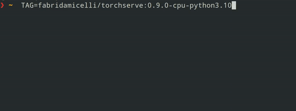

[](https://github.com/fabridamicelli/torchserve-docker/actions/workflows/build-and-push.yaml)

# torchserve-docker

[TorchServe Docker images](https://hub.docker.com/r/fabridamicelli/torchserve) with specific Python version working out of the box.

TorchServe's official docker image `pytorch/torchserve:latest-(cpu/gpu)` uses Python 3.9 as default.
One can get around that by, for example, using that as a base image and building a virtual environment (eg with conda) with another supported Python version (eg 3.10).  
The goal of this cron job is to save you that work by providing you with an image that works with the desired Python version out of the box, for example `pytorch/torchserve:latest-(cpu/gpu)-python-3.10`.  

This is a daily cron job that simply mirrors the official TorchServe repository using their Dockerfile and scripts to build the images, producing ready to use images with the desired Python version (3.8, 3.9, 3.10 or 3.11).  
Thus, any issues or requests regarding the content of the images should addressed directly on the [official torchserve github repository](https://github.com/pytorch/serve)

## Usage


Pick an image tag:
```bash
TAG=fabridamicelli/torchserve:0.9.0-cpu-python3.9
```
Pull the image from dockerhub:
```bash
docker pull $TAG
```
Check the python version inside container:
```bash
docker run --rm -t $TAG exec python --version
```
You should see:
```bash
Python 3.9.18
```

## Available Tags
In general, the [available tags](https://hub.docker.com/r/fabridamicelli/torchserve) are the same that you can find on the official [torchserve repository](https://hub.docker.com/r/pytorch/torchserve/tags) plus a suffix that signals the python version like so `pytorch/torchserve:<TAG>` -> `fabridamicelli/torchserve:<TAG>-python<VERSION>`, where `TAG` is usually something like `0.6.1-gpu`.

Due to some bugs in previous versions of TorchServe docker scripts (and for the sake of keeping things simple), this job produces images only starting from version `torchserve==0.9.0`.


Current tags examples:

| official                      |               `python3.9`                    |                `python3.10`                   |                    `python3.11`                |
| ---- | ---- | ---- | ---- |
|`pytorch/torchserve:0.9.0-cpu` |`fabridamicelli/torchserve:0.9.0-python3.9` |`fabridamicelli/torchserve:0.9.0-python3.10` | `fabridamicelli/torchserve:0.9.0-python3.11` |
|`pytorch/torchserve:0.9.1-gpu` |`fabridamicelli/torchserve:0.9.0-python3.9` |`fabridamicelli/torchserve:0.9.0-python3.10` | `fabridamicelli/torchserve:0.9.0-python3.11` |


### TODO
- Split build and push to use manual dispatch with specific version
